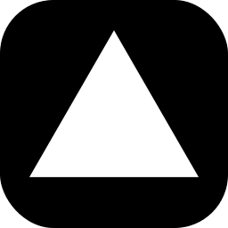

<h3 align="center" style="color: #3934DC;"> Social Media </h3>
  

    
    
  

# Techs

> "The most important thing is to work with technologies that you love." – DHH.

I love low-level programming, but my focus is web development, especially Java (Spring) and NodeJS (NestJS) 🛠 Main technologies I use and love:

---

#### &nbsp;&nbsp;&nbsp;&nbsp;))))  &nbsp;&nbsp;&nbsp;((((  &nbsp;&nbsp;&nbsp;&nbsp;))))  _ &nbsp;.- - -.  (&nbsp;|&grave;- - -'|  &nbsp;\\|&nbsp;&nbsp;&nbsp;&nbsp;&nbsp;&nbsp;&nbsp;&nbsp;|  &nbsp;&nbsp;:&nbsp;&nbsp;&nbsp;.___,&nbsp;&nbsp;&nbsp;:  &nbsp;&nbsp;&grave;- - - - -'  &nbsp;&nbsp;K&nbsp;E&nbsp;E&nbsp;P  &nbsp;&nbsp;C&nbsp;A&nbsp;L&nbsp;M  &nbsp;&nbsp;&nbsp;and  &nbsp;&nbsp;D&nbsp;R&nbsp;I&nbsp;N&nbsp;K  &nbsp;&nbsp;C&nbsp;O&nbsp;F&nbsp;F&nbsp;E&nbsp;E

  

 

